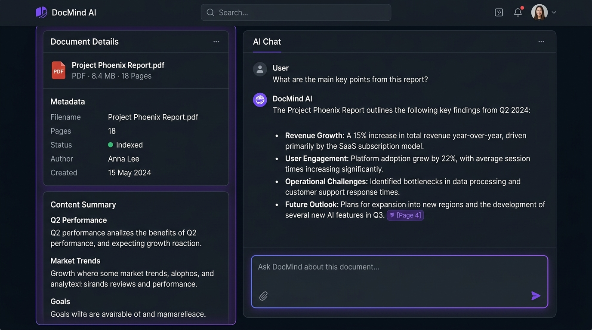

# DocMind AI

> **Ask questions, get grounded answers with page citations — not guesses.**

DocMind AI is a full-stack Retrieval-Augmented Generation (RAG) application that lets you upload a PDF and ask natural-language questions about it. Every answer is grounded in the actual document content and cited back to the exact page it came from — no hallucinated facts, no ungrounded guessing.

Built as a production-style backend: hybrid retrieval (dense + lexical search), token-budget-aware LLM orchestration, thread-safe rate limiting, response caching, and graceful degradation under load — not just a weekend prototype.

---

<p align="center">
  
</p>

---

## ✨ Features

- **PDF Ingestion & Smart Chunking** — PyMuPDF extraction with paragraph-aware chunk boundaries and page metadata preserved throughout the pipeline.
- **Hybrid Retrieval** — Combines dense vector search (FAISS + `BAAI/bge-small-en-v1.5` embeddings) with lexical BM25 keyword search, merged via Reciprocal Rank Fusion (RRF).
- **Grounded, Cited Answers** — Every response traces back to the exact source page(s) it was generated from, shown as interactive citation badges in the UI.
- **Bounded Multi-Turn Chat** — Conversation history is capped (2 turns / 350 tokens) so multi-turn sessions never silently blow past API rate limits.
- **Dynamic Completion Budgeting** — The token budget for each answer scales with question complexity (768 / 1,536 / 3,072 tokens) based on how much context retrieval actually pulled in, so broad synthesis questions get enough room to finish and narrow ones don't waste quota.
- **Response Caching** — Repeated or near-identical questions are served from an in-memory LRU cache in under 5ms, with zero additional API cost.
- **Graceful Load Handling** — Under heavy concurrent traffic, the app returns a fast, friendly "busy" message instead of hanging or throwing raw errors.
- **Fully Async Backend** — LLM calls are offloaded to a thread pool so the API event loop never blocks under load.

---

## 🏗️ How It Works

```
┌─────────────────────────────────────────────────────────┐
│                   Frontend (Next.js)                    │
│        Upload → Dashboard → Chat UI with citations      │
└─────────────────────────────────────────────────────────┘
                            │
                   POST /chat/{doc_id}
                            ▼
┌─────────────────────────────────────────────────────────┐
│                    FastAPI Backend                      │
│                                                         │
│ 1. Check response cache → instant hit? return in <5ms   │
│ 2. Check token headroom → near limit? friendly busy msg │
│ 3. Hybrid retrieval → FAISS (dense) + BM25 (lexical)    │
│    merged via Reciprocal Rank Fusion (RRF)              │
│ 4. Assemble prompt within token budget (history + chunks│
│ 5. Size the completion budget to question complexity    │
│    (768 / 1,536 / 3,072 tokens — narrow vs. broad)      │
│ 6. Call LLM (openai/gpt-oss-20b via Groq) in a worker   │
│    thread — event loop stays responsive                 │
│ 7. Return grounded answer with page-level citations     │
└─────────────────────────────────────────────────────────┘
```

> **Why step 5 matters**: `openai/gpt-oss-20b` is a reasoning model — it "thinks" internally before writing its final answer, and both the thinking and the answer share one token budget. A narrow question needs far less room than a broad one like *"Explain the complete architecture of X."* Instead of one fixed budget that's wrong for one end of that range, the completion budget scales with how much context retrieval pulled in, so broad synthesis questions get enough room to finish.

---

## 🧱 Tech Stack

- **Backend**: Python 3.12+, FastAPI, PyMuPDF, Sentence-Transformers, FAISS, BM25, Groq SDK, Pydantic
- **Frontend**: Next.js 16 (App Router), React 19, TanStack Query, Tailwind CSS, React-Markdown

---

## 🚀 Quick Start

### 1. Clone the repo

```bash
git clone https://github.com/Ruthiraj-Gosula/DocMind-AI.git
cd DocMind-AI
```

### 2. Get a free Groq API key

Sign up at [console.groq.com/keys](https://console.groq.com/keys) — it's free, no credit card required.

### 3. Set up the backend

```bash
cd backend
cp .env.example .env
```

Open `.env` and paste your Groq API key into `GROQ_API_KEY=`.

```bash
pip install -r requirements.txt
uvicorn app.main:app --reload
```

Backend runs at `http://127.0.0.1:8000`. Interactive API docs at `http://127.0.0.1:8000/docs`.

### 4. Set up the frontend

```bash
cd ../frontend
cp .env.example .env.local
npm install
npm run dev
```

Frontend runs at `http://localhost:3000`.

*(Note: If `.env.local` is omitted, the frontend automatically falls back to proxying `/api/*` requests straight to `http://127.0.0.1:8000`.)*

### 5. Try it out

1. Open `http://localhost:3000` in your browser.
2. Upload a PDF, wait for it to finish processing, and start asking questions!

---

## ⚠️ Known Limitations

This project runs on Groq's free developer tier, which has two separate limits worth knowing about:

- **Per-Minute Limit (8,000 TPM)** — Comfortably supports ~5 concurrent active users. If traffic briefly spikes above that, you'll see a friendly *"currently busy"* message instead of an answer, or a short automatic wait — this is expected behavior, not a bug.
- **Per-Day Limit (200,000 TPD)** — A separate, cumulative daily cap. It's easy to hit this only if you do heavy, sustained testing (dozens of broad questions) in one sitting — normal demo usage won't come close. It resets gradually on a rolling 24-hour basis, not all at once at midnight.
- **Broad Synthesis Token Consumption** — Broad *"explain everything about X"* questions cost more tokens per answer (since the model needs more room to reason through a synthesis across many chunks) than narrow, focused questions. This is handled automatically by the dynamic completion budgeting described above, but broad questions consume quota faster.
- **Single-Document Scope** — Each chat session is scoped to a single document — cross-document search isn't currently supported.
- **In-Memory State** — Rate limiting and response caching are in-memory per process; a multi-instance production deployment would want to back these with Redis.
- **Self-Contained Usage** — Since you run this with your own free Groq API key, your usage and quota are completely separate from anyone else's — someone else hitting their daily limit has zero effect on you.

---

## 📄 License

MIT — see [LICENSE](LICENSE) for details.
